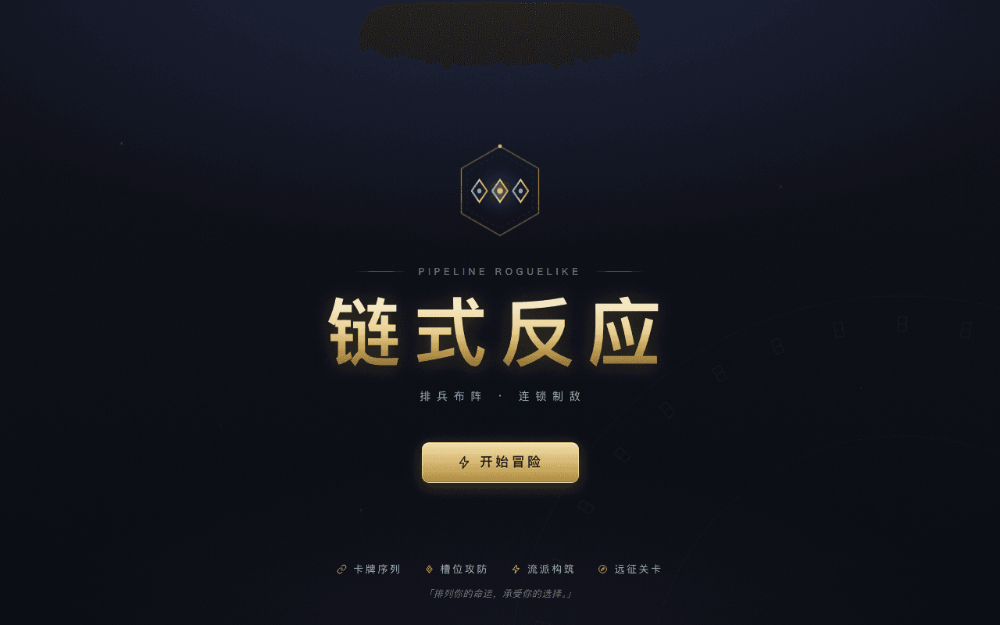

# Chain Reaction - 链式反应

[](https://chain-reaction-demo.vercel.app)

一款基于**管道序列（Pipeline）**的卡牌 Roguelike。你将卡牌排入槽位，卡牌按序结算形成连锁；敌人攻击的不是你，而是你的**槽位**——每一张牌既是进攻，也是那一格的守军。

🎮 **在线试玩**: http://chain.yingzhu252.xyz

## v3 视觉重构 ·「玄铁仪典」

前端表现层整体重做，材质体系锁定「玄铁板甲 / 鎏金黄铜 / 秘能青焰」：

- **全套 SVG 符文图标**：消灭 emoji 图标（⚔️💀🎁…），自绘 40+ 蚀刻线稿符文
- **卡牌解剖学重设计**：名牌 + 稀有度宝石 + 秘能数值盘（符环/六边纹章）+ 关键词印记 + 类型缎带；稀有卡箔光扫过、锻造卡鎏金描边
- **战斗舞台化**：敌人浮空台座 + 接触辉光、蚀刻刻度血条、意图铭牌；序列槽改为导轨插槽，执行时沿线传导能量脉冲
- **程序化场景**：符文巨环、秘能微粒、鎏金雾霭、噪点颗粒与暗角全部由 CSS/SVG 生成，替代原 AI 粒子底图
- **界面统一**：标题/创建/地图/奖励/商店/休息/结算共用同一套面板、按钮、蚀刻条与排版体系

## v2 版本亮点

- **四大流派构筑**：连锁（排序滚雪球）· 共鸣（摆位互相加成）· 反击（完美格挡反伤）· 焚身（生命即资源）
- **38 张卡牌 + 稀有度体系**（普通/罕见/稀有）+ 锻造升级
- **10 种敌人意图**（新增蓄力/蓄势/双重打击/增益/衰弱）、4 场维度设防精英战、3 只多阶段 Boss
- **标准/精英双难度**、Monte-Carlo 平衡模拟器验证（`scripts/simulate.ts`）
- **爽点层**：连击计数、伤害分级飘字、OVERDRIVE 过载特效、反击"反！"标记

## 界面一览

| 标题 | 地图 |
|---|---|
|  |  |

| 战斗 | 结算 |
|---|---|
|  |  |

更多截图见 [docs/screenshots](./docs/screenshots/)（创建角色 / NPC 援助 / 奖励 / 商店 / 休息 / 终局 等 15 张）。

## 快速开始

```bash
npm install
npm run dev      # 开发模式 http://localhost:5173
npm run build    # 类型检查 + 生产构建
npm run lint     # ESLint
npm run preview  # 预览生产构建
```

## 技术栈

React 19 · TypeScript · Vite · Tailwind CSS 4 · Zustand(Immer) · @dnd-kit · Framer Motion

## 文档导航

| 文档 | 内容 |
|------|------|
| [docs/REVIEW.md](./docs/REVIEW.md) | 2026-09 全面代码审查报告（Bug/冗余/UX/性能） |
| [docs/IMPROVEMENT_PLAN.md](./docs/IMPROVEMENT_PLAN.md) | 修复优化与数值机制重构总体方案 |
| [docs/BALANCE.md](./docs/BALANCE.md) | 数值白皮书（数值框架、曲线、卡表、模拟器实测） |
| [docs/RESEARCH_NOTES.md](./docs/RESEARCH_NOTES.md) | 现代卡牌游戏数值设计调研笔记 |
| [docs/legacy/](./docs/legacy/) | 早期策划配置表（历史参考） |

## 工具脚本

```bash
npx tsx scripts/simulate.ts 400    # 蒙特卡洛平衡模拟（胜率/流派/卡池抽查）
npx tsx scripts/e2e-smoke.ts       # E2E 冒烟测试（需本地 dev 或设置 E2E_BASE_URL）
npx tsx scripts/e2e-extended.ts    # E2E 扩展场景（商店/锻造/精英/难度）
npx tsx scripts/capture-screens.ts # 截取标题→战斗主流程截图
npx tsx scripts/capture-scenes.ts  # 补拍 奖励/商店/休息/结算场景截图
node scripts/optimize-shots.mjs docs/screenshots  # 截图压缩（PNG 调色板量化）
npm run build                      # 生产构建（tsc + vite）
```

## 项目结构

```
src/
├── components/   # React 组件（战斗、地图、商店、奖励等界面）
├── data/         # 卡牌模板 / 敌人模板 / 地图生成
├── engine/       # 效果注册表、管道执行、槽位战斗结算（纯函数核心）
├── store/        # runStore（Roguelike 长线） + gameStore（单场战斗）
└── types/        # TypeScript 类型与常量
```

## 核心规则速览

- **阶段一**：手牌拖入 5~8 个管道槽位，从左到右依次结算；修饰卡改写后续卡牌（×N、重复 N 次、共鸣…）
- **阶段二**：敌人按公示意图攻击特定槽位——有盾格挡、有卡换血、空槽受击且叠"破绽"
- **阶段三**：管道累计总伤害扣敌人血，生成下回合意图
- **Roguelike**：多层地图（战斗/商店/休息/事件/精英/Boss），战后排卡、金币、遗物、槽位扩建

