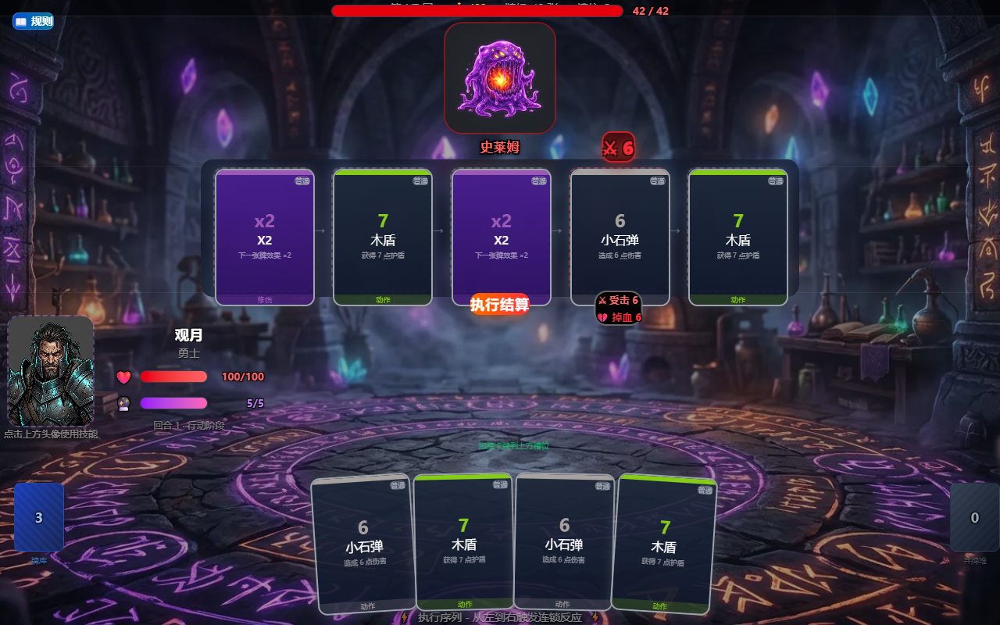
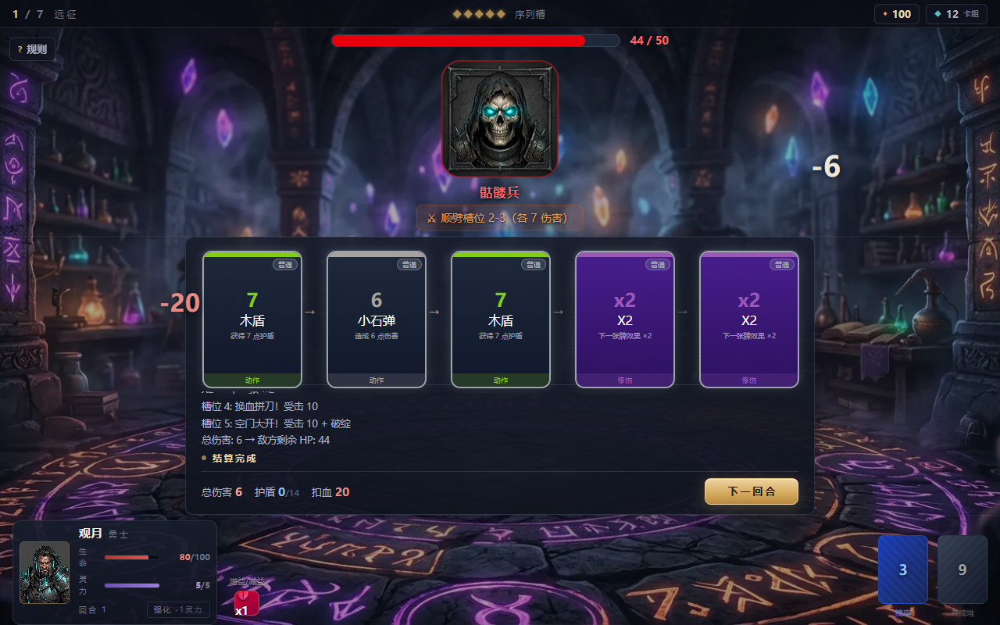
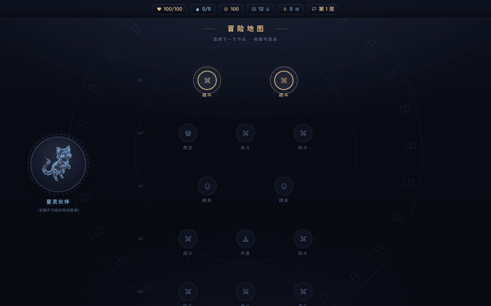

# 链式反应 · Chain Reaction

> 一款**排兵布阵式**卡牌 Roguelike——你把卡牌排进序列槽，它们从左到右依次引爆；
> 而敌人攻击的不是你，是你的**槽位**。每一张牌，既是进攻，也是那一格的守军。

🎮 **在线试玩**：http://chain.yingzhu252.xyz

|  |  |
|:---:|:---:|
| 排布你的序列 | 连锁结算 |

|  |  |
|:---:|:---:|
| 远征地图 | 战斗援助 |

---

## 怎么玩

每个回合分三步：

1. **布阵** —— 从手牌中挑选卡牌，拖拽（或点选）置入 5 个序列槽；
2. **连锁** —— 点击「执行结算」，卡牌从左到右依次触发。修饰牌放在左侧，可以成倍强化右侧的牌；
3. **攻防** —— 敌人同时按预告攻击指定槽位：有盾的格子格挡，空着的格子会被打破并叠加「破绽」。

杀掉敌人就赢，血被打空就输。7 层远征，击败 Boss 即通关。

## 四大流派

| 流派 | 关键词 | 玩法 |
|------|--------|------|
| ⚡ **连锁** | 连锁 N：左侧每有一张攻击牌已执行，就多触发一次 | 把攻击牌排在前面，让连锁牌滚成雪球 |
| ≋ **共鸣** | 与相邻的同类卡互相 +50% | 把同类卡摆在一起，位置就是伤害 |
| 🛡 **反击** | 本槽被攻击且未掉血时，反戈一击 | 读准敌人的意图，请君入瓮 |
| 🔥 **焚身** | 支付生命，换取数倍的爆发 | 血线是第二资源条，胆子越大伤害越高 |

流派之间可以自由混搭——「共鸣点火 + 连锁收尾」的混合队同样能打。

## 一局之内

- **远征地图**：7 层随机路径，战斗 / 商店 / 休息 / 事件 / 精英 / Boss
- **精英战**：4 只精英各设一考——防御峰值、槽位经济、序列运转、平均格挡
- **多阶段 Boss**：血量过半进入狂怒，招式全套换新
- **锻造**：在休息处永久强化一张卡牌
- **遗物**：改变规则的被动宝物，精英必掉
- **双难度**：标准与精英（敌人更强，掉落更好）
- ……以及，试着和地图上的猫多聊几次。

## 用自己的电脑跑

```bash
npm install
npm run dev        # 开发模式 http://localhost:5173
npm run build      # 生产构建
```

需要 Node.js 18+。

## 给贡献者 / 想改数值的人

- 战斗核心是纯函数引擎：`src/engine/effectRegistry.ts`
- 全部数值集中在 `src/config/balance.ts` 一个文件里，改完跑 `npx tsx scripts/simulate.ts 400` 就能看四流派胜率
- 设计文档：[数值白皮书](docs/BALANCE.md) · [代码审查](docs/REVIEW.md) · [重构方案](docs/IMPROVEMENT_PLAN.md) · [设计调研](docs/RESEARCH_NOTES.md)
- 回归测试：`npx tsx scripts/e2e-smoke.ts`（需要本地起 dev server）

技术栈：React 19 · TypeScript · Vite · Tailwind CSS 4 · Zustand · Framer Motion

---

*排列你的命运，承受你的选择。*
